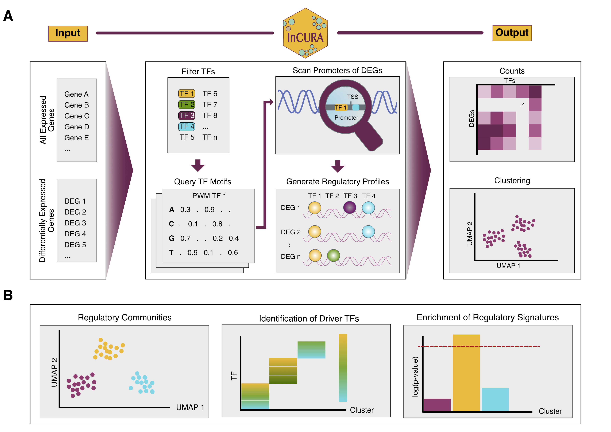

# InCURA 
## Integrative Gene Clustering on Transcription Factor Binding Sites 

### Concept
Biologically meaningful interpretation of transcriptomic datasets remains challenging, particularly when context-specific gene sets are either unavailable or too generic to capture the underlying biology. We present InCURA, an integrative clustering strategy based on transcription factor (TF) motif occurrence patterns in gene promoters. InCURA relies on a user-friendly input of lists of (i) all expressed genes, used to identify dataset-specific TFs, and (ii) differentially expressed genes (DEGs). Promoter sequences of DEGs are scanned for TF binding motifs, and the resulting counts are compiled into a gene-by-TF matrix. InCURA then uses unsupervised clustering to infer gene modules with shared predicted regulatory input. Employing InCURA to diverse biological datasets, we uncovered functionally coherent gene modules revealing upstream regulators and regulatory programs that standard enrichment or co-expression analyses, such as WGCNA, fail to detect. Together, InCURA provides a regulation-centric tool for dissecting transcriptional responses for fundamental biological discovery research, particularly in settings lacking context-specific gene sets.



### Usage
The main version of InCURA is implemented as a user-friendly [web application](https://incura.streamlit.app/). The InCURA app enables easy access to the main fucntionalities: DEG clusterin and idenification of driver TFs. **We highly recommend using the web app.**

**Note:** 
This web app version is based on the analysis of a long promoter region: -2000, 500 bp around TSS. Further, it uses a fixed Markov background model for motif scanning derived from the promoter regions of all coding genes. 


If you would like to manipulate other parameters in the InCURA workflow please clone the GitHub repository. Please note that **InCURA needs snakemake and Apptainer (formerly Singularity)** to run, to reproduce the environment. For installation please check the [documentation](https://apptainer.org/documentation/).

### 1. Installation
Clone repo:
```
git clone git@github.com:saezlab/incura.git
cd incura
```

Then create a new enviroment specific for `Snakemake`:
```
mamba create -c conda-forge -c bioconda -n snakemake snakemake
mamba activate snakemake
```

### 2. Configuration
Make sure to change the organism in the config file according to your needs. If you would like to run InCURA on a custom organism, set the "organism" variable in the config file accoerdingly and add a valid download link for a reference genome. 


Add your DEGs_myDataset.txt and all_genes.txt to the data directory and modify the Snakefile according to your dataset: 

```
rule all:
    input: 
        'data/fimo_myDataset/fimo.tsv'
```

### 3. Run with default parameters
Run the workflow with snakemake. Change the cores according to your computational resources: 

```
snakemake -s workflow/Snakefile --cores 8 --use-singularity
```

### 4. Adjust parameters for custom workflow
There are several paramters in InCURA that can be changed to adjust the workflow to the specific needs of the user: 

#### Change promoter length 
To adjuster the length of the promoter region that is scanned for TFBS occurrences, please navigate to the snakemake rule file "workflow/rules/getPromoters.smk":
```
rule extractPromoters:
    input:
        genome='data/genome.fa',
        annot='data/coding_genes.gtf'
    output:
        db=temp('data/gff.db'),
        promoters='data/promoters.csv'
    singularity:
        'workflow/envs/InCURA.sif'
    threads: 32
    shell:
        """
        echo "Extracting promoters..."
        get_promoter create -g {input.annot} && mv gff.db data/
        get_promoter extract -l 2000 -u 500 -f {input.genome} -g {output.db} -o {output.promoters}
```
There the arguments -l (bp upstream of TSS) and -u (bp downstream of TSS) can be changed according to your needs.

#### Motif Processing and Clustering 
Please run the steps described in the notebook incura_prc.py.ipynb

#### Downstream Analysis
For signature enrichment analysis please run the steps described in the demo_Tcell_exhaustion.py.ipynb notebook. 

### Citation

[](https://doi.org/10.5281/zenodo.15753472)


